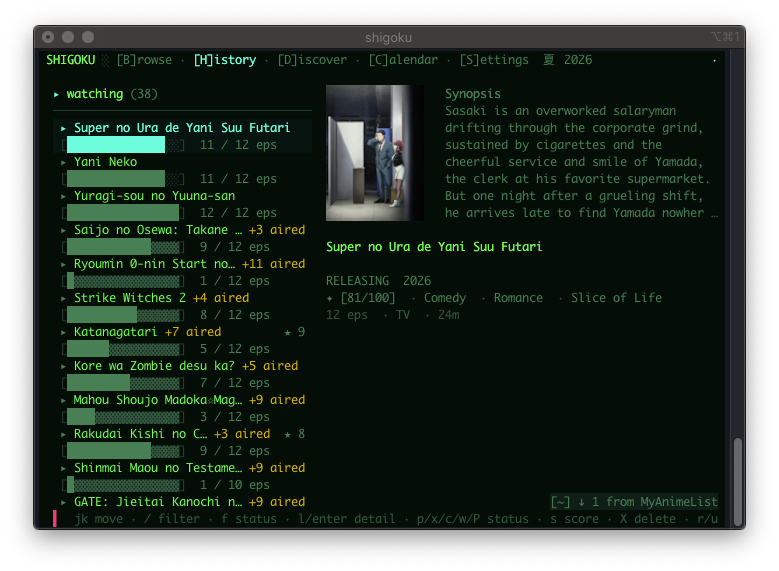
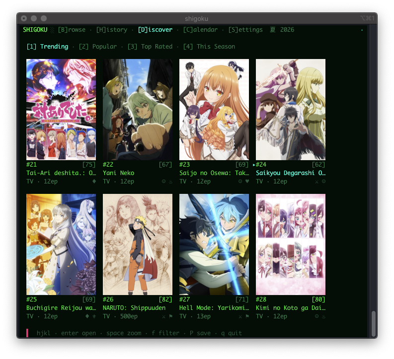

# shigoku

A fast, portable terminal client for watching anime — search, cover art
rendered directly in the terminal, an episode grid and playback through
`mpv` with resume and optional opening/ending auto-skip. Keeps a local
watchlist that can sync with your AniList and MyAnimeList accounts.

It also ships a small SDL page viewer (`shigoku-view`) and manga reader
(`shigoku-manga`) for images, PDFs/EPUBs and comic archives (CBZ/CBR/CBT).





## Quick start

```sh
cmake -S . -B build -DCMAKE_BUILD_TYPE=Release
cmake --build build -j
./build/shigoku
```

Press `/` to search, `Enter` on a result to open it, `Enter` on an episode
to play it, `q` to quit. Full key reference and every feature:
[docs/MANUAL.md](docs/MANUAL.md).

## Requirements

- Unix-like OS (macOS, BSD, Linux).
- A C++23 compiler and CMake ≥ 3.20.
- **libcurl** (built with HTTP/2), **sqlite3**, **OpenSSL**.
- **mpv** on your `PATH` for playback (the default and most capable
  backend; `mplayer` and `qmplay2` also work — see the manual).
- **libsdl**, **mupdf**, **libarchive** for manga reader.
- optional runtime dependencies: **curl-impersonate** and **nodejs** (some providers need them).

Cover art needs a terminal with support for kitty/iterm/sixel graphics protocol.

For macOS the app can be installed via PowerPC Ports: https://macos-powerpc.org

## License

[GPL-3.0-or-later](LICENSE).
